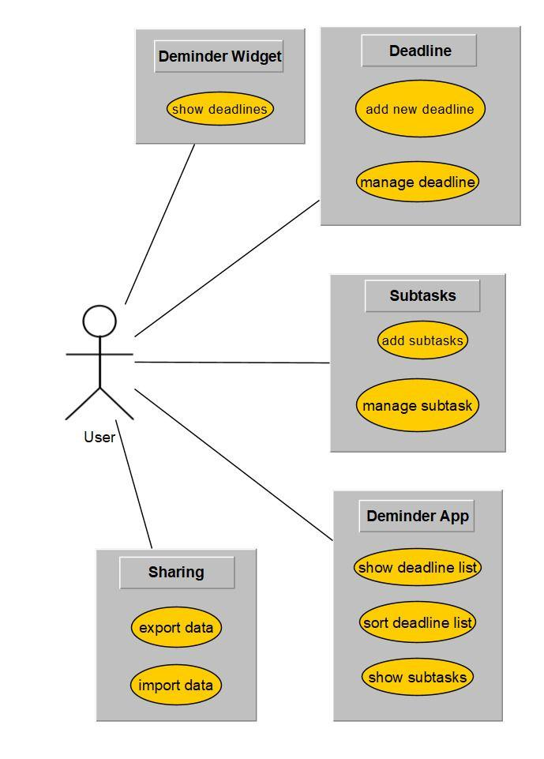

# Software Requirements Specification

# 1. Introduction

## 1.1 Purpose

This SRS describes the Android App Deminder. It contains a comprehensive list of all it's behavior and its requirements. This includes both requirements for the listed functionalitys but also internal, nonfunctional requirements of the project. 

## 1.2 Scope

Deminder is an Android App that will remind the user of upcoming deadlines such as exams. The app also uses a widget to show the user an overview of their deadlines outside of the app. 

## 1.3 Definitions, Acronyms and Abbreviations

n.a.: Not applicable
App Store: Google play store

## 1.4 References

Android Studio: https://developer.android.com/studio/
Git: https://git-scm.com/
GitHub: https://github.com/
Google Play Store: https://play.google.com/store
YouTrack: https://www.jetbrains.com/youtrack/

## 1.5 Overview

The following chapters describe our vision for the project, the requirements for it, the conventions we want to develop it with  and the technical realization of this project.

# 2. Overall Description

Deminder will be a an Android app which focuses on creating deadlines, assigning subtasks to them and keeping track of the progress of the tasks that are to do until the deadline occurs. There will be a possibility to create recurring deadlines as well. Also, there will be possibilities to show deadlines on a andoid widget and to share them on a server.

# 3. Specific Requirements

## 3.1 Functionality

### 3.1.1 Create deadline

Create a new deadline with a title, due date, an optional description, optional substasks and check if it is a recurring deadline. Then save the new deadline on the users phone.

### 3.1.2 Edit deadline

Edit an existing deadline. Change the title, due date, the description, add, delete or check substasks as finished and edit if it is a reacurring deadling. Or completely delete the deadline. Then save the edited deadline on the users phone or delete the deadline. 

### 3.1.3 Show subtasks

Show the subtasks of one deadline.

### 3.1.4 Mark subtask as finished

Mark one subtask of a deadline as done.

### 3.1.5 Change settings

Manage options. 

### 3.1.6 Change list order

Order list by due date or number of open subtasks.

### 3.1.7 Share deadline

Share deadline on a server.

### 3.1.8 Import deadline

Import a new deadline from a server.

## 3.2 Usability

### 3.2.1 Intuitiv UI

The user should be able to use the app with all its functions from scratch.

### 3.2.2 Fast access to all functions

The user should be able to perform every action as fast as possible.

## 3.3 Reliability

### 3.3.1 Data is never lost or corrupted

Every deadline is saved after changes to it. The saving process must insure that no data is lost.

### 3.3.2 Accurate time

Time is constantly synchronised to insure correct due dates.

### 3.3.3 Always active

Make sure the app is not killed by the android system.

## 3.4 Performance

### 3.4.1 Fast loading

Opening the app should not be delayed by the loading of deadlines from the phone.

### 3.4.2 Asynchronus saving

The user interface should not be blocked by deadlines that are beeing saved (use threads).

### 3.4.3 Low response time

Using the functions of the app should feel instantanious for the user.
 

## 3.5 Supportability

### 3.5.1 Conventions

The code should follow the Java Naming Conventions and using speaking variable and function names

### 3.5.2 Clear programm structure supporting modularity

Every class should have one clear purpose. This means the code should be contained of many easily maintainable modules/classes. If a class has more then one purpose, consider to split it up into multiple classes.

### 3.5.3 Clean code

Review code by another developer before pushing it into the main branch. Make sure there are no code dublicates or bad practices. It should always be clear what the code does, even without comments.

### 3.5.4 Clean commits

All commits should follow conventions set up for this project. Every commit should clearly describe what it does. Link commits to their YouTrack tasks so it is clear where the task was implemented.

## 3.6 Design Constraints

### 3.6.1 Java

Java is the software language of this project.

### 3.6.2 Android Studio

Due to the fact that Deminder will be an Android app, Android Studio will serve as IDE.

### 3.6.3 Git

Git will serve as tool for version control and team development

### 3.6.4 YouTrack

YouTrack serves as project management tool.

### 3.6.5 Wordpress

There is a wordpress blog for realising news on the project state.

## 3.7 On-line User Documentation and Help System Requirements

Minimal description in the app store entry. It should describe all features and give one example. It has to contain screenshots of the app.

## 3.8 Purchased Components

n.a.

## 3.9 Interfaces

### 3.9.1 User Interfaces

- App view with a list of deadlines.
- Settings view.
- Create/edit deadline view.
- Widget view.

### 3.9.2 Hardware Interfaces

n.a.

### 3.9.3 Software Interfaces

Interface to manage the local savefile(s) of deadlines and settings.

### 3.9.4 Communications Interfaces

Connection a server for exchanging data regarding deadlines (import and export) has to be possible. 

## 3.10 Licensing Requirements

n.a.

## 3.11 Legal, Copyright, and Other Notices

n.a.

## 3.12 Applicable Standards

n.a.

# 4. Supporting Information

n.a.
