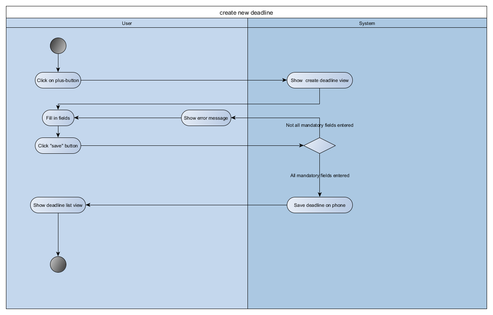
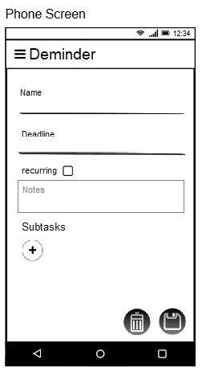

# Use-Case Specification: add deadline usecase

# 1. Use-Case Name

# 1.1 Brief Description

This use case allows the user to create a deadline. There are many text fields that can be filled out, containing information about the deadline. 
Some of the fields are mandatory, some are optional. The user can also choose to add or remove subtasks for the deadline that will be created.

# 2. Flow of Events

## 2.1 Basic Flow

### 2.1.1 Activity Diagram

### 2.1.2 Mock up

### 2.1.3 Feature

[Feature](~/app/src/androidTest/assets/addDeadline.feature)

## 2.2 Alternative Flows
n.a.

# 3. Special Requirements

##3.1 Screen size support

Since the app can be used on every android phone, there will be many different screen sizes.
The layout should not waste space on big screens and should still be readable on small screens.

# 4. Preconditions

## 4.1 App opened on screen
To add a new deadline the app must be running and open on the screen.

# 5. Postconditions

## 5.1 Creation succesful
Creation view is closed and the list of deadlines, containing the newly created deadline is shown.

## 5.2 Creation failure
Display a notification, showing that and why (if possible) the creation of the deadline failed.

# 6. Extension Points

n.a.
