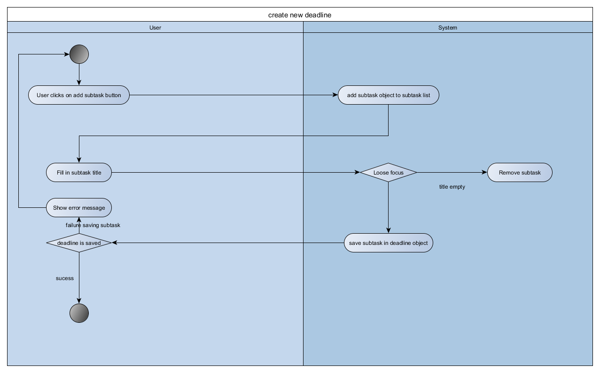
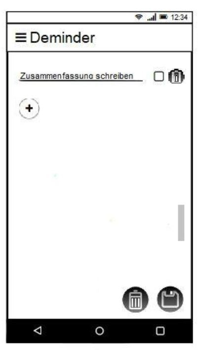

# Use-Case Specification: add deadline usecase

# 1. Use-Case Name

# 1.1 Brief Description

This use case allows the user to add a subtask to a new or existing deadline. 
A subtask has a title textfield that needs to be filled out and has a checkbox that is not checked by default. 
The user can add or remove as many subtasks for the deadline as he wants.

# 2. Flow of Events

## 2.1 Basic Flow

### 2.1.1 Activity Diagram

### 2.1.2 Mock-Up

### 2.1.3 Feature

## 2.2 Alternative Flows
n.a.

# 3. Special Requirements

##3.1 Screen size support

Since the app can be used on every android phone, there will be many different screen sizes.
The layout should not waste space on big screens and should still be readable on small screens.

# 4. Preconditions

## 4.1 App opened on screen
To add a new deadline the app must be running and open on the screen.

## 4.2 The current view allows creating/editing subtasks
The user is in the create or edit deadline view.

# 5. Postconditions

## 5.1 Creation succesful
Creation view is closed and the list of deadlines, containing the edited or created deadline with the newly created subtasks are shown.

## 5.2 Creation failure
Display a notification, showing that and why (if possible) the creation of the subtask failed.

# 6. Extension Points

n.a.