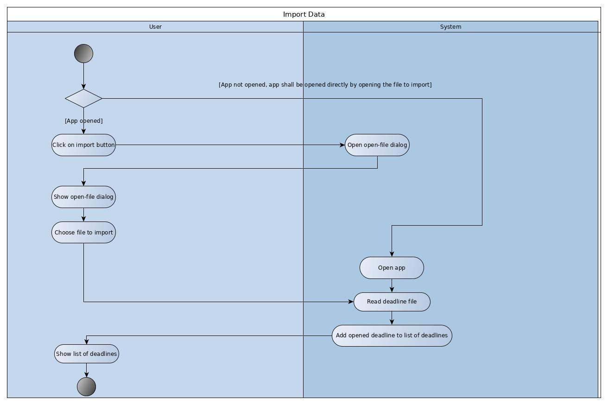
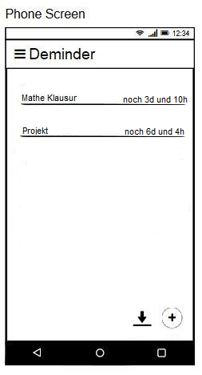

# Use-Case Specification: Import Data

# 1. Use-Case Name

# 1.1 Brief Description

This use case allows the user to manage a subtask, containing the name, if it is already done and the option to delete it.

# 2. Flow of Events

## 2.1 Basic Flow

### 2.1.1 Activity Diagram

### 2.1.2 Mock-Up

### 2.1.3 Feature

n.a.

## 2.2 Alternative Flows

n.a.

# 3. Special Requirements

## 3.1 Screen size support

Since the app can be used on every android phone, there will be many different screen sizes. The layout should not waste space on big screens and should still be readable on small screens.

# 4. Preconditions

## 4.1 App opened on screen

To import a deadline, the app can be opend via the appropriate file. Alternatively, the app first have to be opend and the existing file selected to import the deadline. 

## 4.2 The deadline to be imported already exist

To import a deadline, it has to exist. 

# 5. Postconditions

## 5.1 Managing success
Subtask can be shown in the deadline overview. 

## 5.2 Managing failure

Display a notification, saying that and why (if possible) the managing failed.

# 6. Extension Points

n.a.
