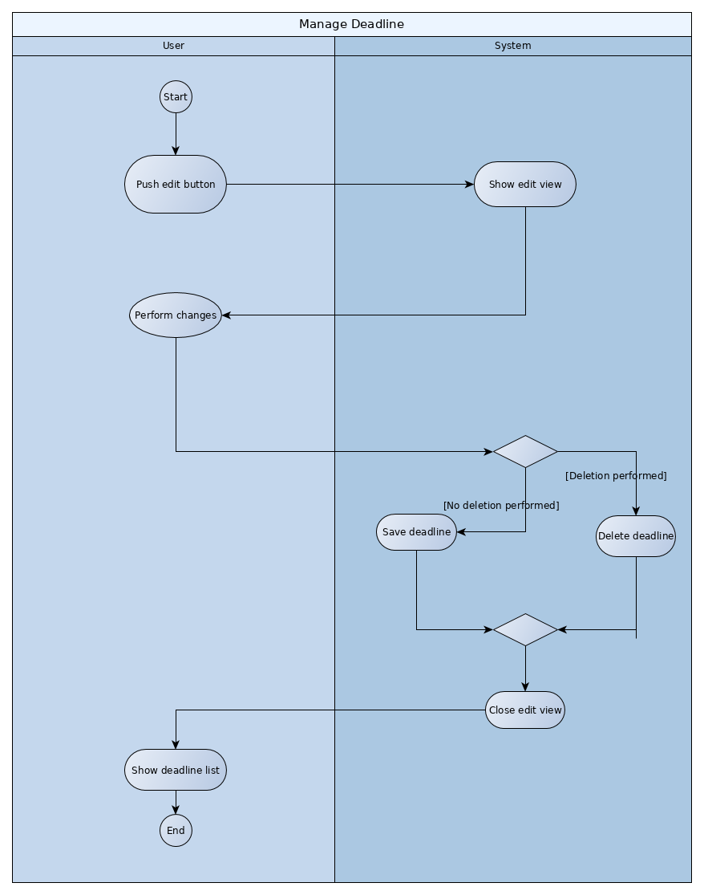
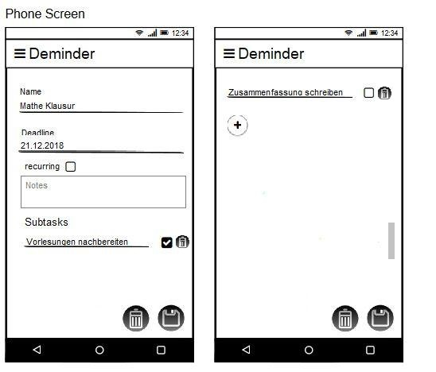

# Use-Case Specification: Manage deadline usecase

# 1. Use-Case Name

# 1.1 Brief Description

This use case allows the user to manage an already created deadline. He can edit poperties of the deadline such as name, due date and description or delete the deadline. It is also possible to add subtasks or mark them as done. 

# 2. Flow of Events

## 2.1 Basic Flow

### 2.1.1 Activity Diagram

### 2.1.2 Mock-Up

### 2.1.3 Feature

[Feature](/app/src/androidTest/assets/manageDeadline.feature)

## 2.2 Alternative Flows

n.a.

# 3. Special Requirements

## 3.1 Screen size support

Since the app can be used on every android phone, there will be many different screen sizes. The layout should not waste space on big screens and should still be readable on small screens.

# 4. Preconditions

## 4.1 App opened on screen

To manage a deadline the app must be running and opened on the screen. 

## 4.2 The deadline to be managed is already created

To manage a deadline, it has to exist. 

# 5. Postconditions

## 5.1 Managing success

Managing view is shown and the screen with all (including the edited or without the deleted) deadlines is shown. 

## 5.2 Managing failure

Display a notification, saying that and why (if possible) the editing or deleting of the deadline failed.

# 6. Extension Points

n.a.

## 7. Function Point calculation
|transaction|DET|RET|FTR|Complexity|
|---|---|---|---|---|
|external input|3|8|2|low|
|external output|2|4|2|low|
|external inquieries||||low|
|internal logical files||||low|
|external interface files||||low|

This makes 30,2 FP
