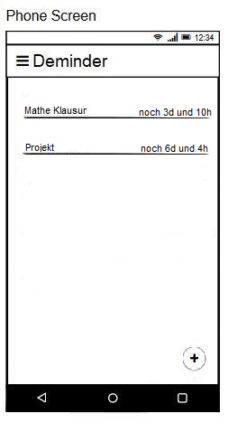

# Use-Case Specification: Show Deadline List

# 1. Use-Case Name

# 1.1 Brief Description

This use case is responsible for displaying the created deadlines.

# 2. Flow of Events

## 2.1 Basic Flow

### 2.1.1 Activity Diagram

### 2.1.2 Mock-Up

### 2.1.3 Feature

[Feature](/app/src/androidTest/assets/showDeadlineList.feature)

## 2.2 Alternative Flows

n.a.

# 3. Special Requirements

## 3.1 Screen size support

Since the app can be used on every android phone, there will be many different screen sizes. The layout should not waste space on big screens and should still be readable on small screens.

# 4. Preconditions

## 4.1 App opened on screen

The App has to be opend.

# 5. Postconditions

## 5.1 Managing success

The screen with all deadlines is shown. 

## 5.2 Managing failure

Display a notification, saying that and why (if possible) displaying the deadlines failed.

# 6. Extension Points

n.a.
