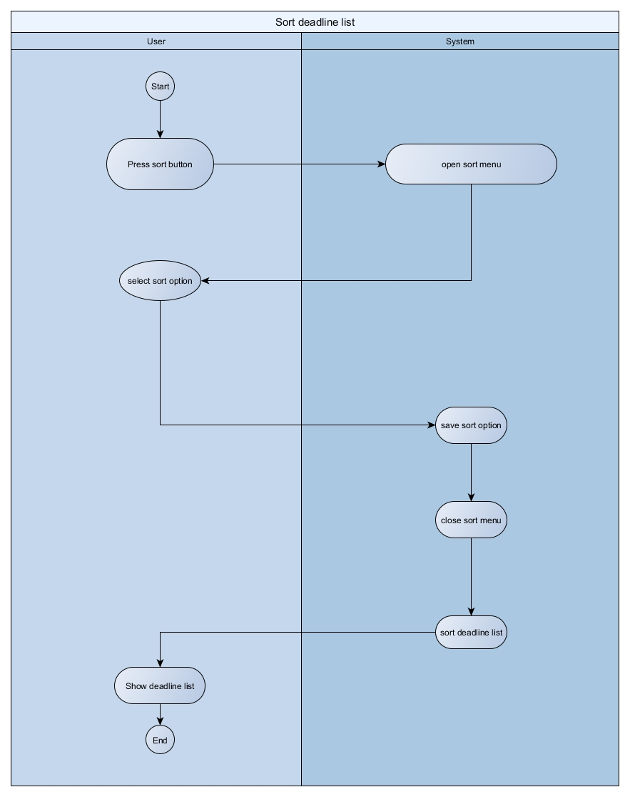
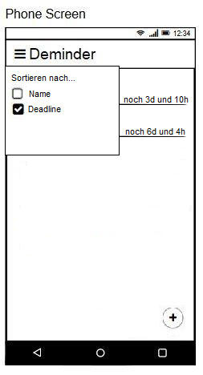

# Use-Case Specification: Sort Deadline List

# 1. Use-Case Name

# 1.1 Brief Description

This use case allows the user to sort deadlines alphabetically or by date.

# 2. Flow of Events

## 2.1 Basic Flow

### 2.1.1 Activity Diagram

### 2.1.2 Mock-Up

### 2.1.3 Feature

n.a.

## 2.2 Alternative Flows

n.a.

# 3. Special Requirements

## 3.1 Screen size support

Since the app can be used on every android phone, there will be many different screen sizes. The layout should not waste space on big screens and should still be readable on small screens.

# 4. Preconditions

## 4.1 App opened on screen

To sort deadlines, the app must be running and opened on the screen. 

## 4.2 The deadlines to be sorted are already created

To sort deadlines, they have to exist. 

# 5. Postconditions

## 5.1 Managing success
Deadlines are sorted alphabetically or by date in the deadline overview. 

## 5.2 Managing failure

Display a notification, saying that and why (if possible) the sorting failed.

# 6. Extension Points

n.a.

## 7. Function Point calculation
|transaction|DET|RET|FTR|Complexity|
|---|---|---|---|---|
|external input|2|||low|
|external output|||1|low|
|external inquieries||||low|
|internal logical files|||1|low|
|external interface files||||low|

This makes 10,9 FP