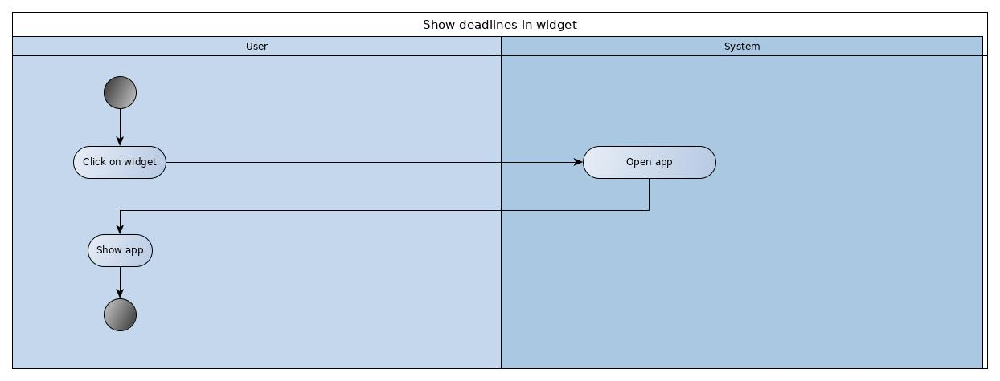
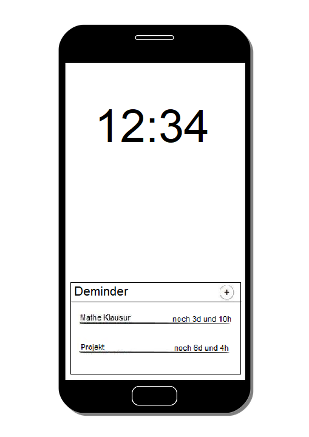

# Use-Case Specification: Widget

# 1. Use-Case Name

# 1.1 Brief Description

This use case allows the user to display his deadlines directly on the home screen.

# 2. Flow of Events

## 2.1 Basic Flow

### 2.1.1 Activity Diagram

### 2.1.2 Mock-Up

### 2.1.3 Feature

n.a.

## 2.2 Alternative Flows

n.a.

# 3. Special Requirements

## 3.1 Screen size support

Since the app can be used on every android phone, there will be many different screen sizes. The layout should not waste space on big screens and should still be readable on small screens.

# 4. Preconditions

## 4.1 App is installed

To see the widget, all you need to do is unlock your phone.

## 4.2 The deadlines are already created

For deadlines to appear in the widget, they must have already been created with the app.

# 5. Postconditions

## 5.1 Managing success
The Widget, including the Deadlines, can be shown on the home screen. 

## 5.2 Managing failure

Display a notification, saying that and why (if possible) the managing failed.

# 6. Extension Points

n.a.
